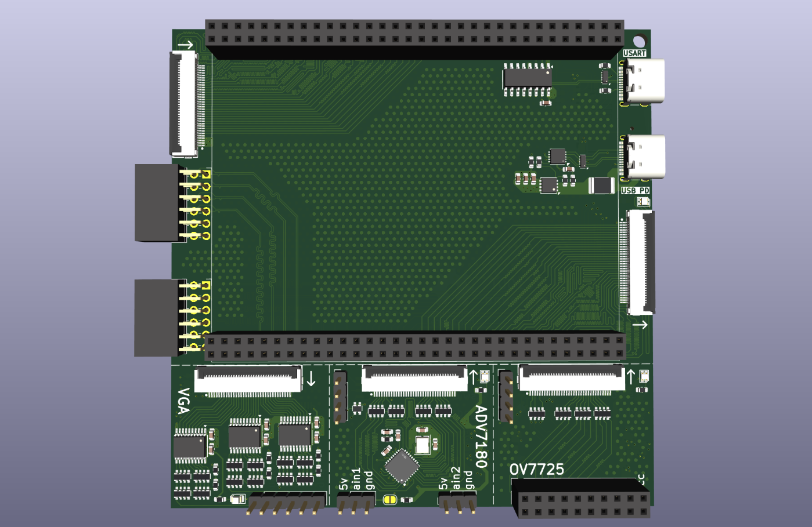

# QMTECH_XC7A100T-Expantion-Board

Expantion board for the QMTECH_XC7A***T series for video processing learning.

This board contains 4 separate designs to save on cost. The boards can be ordered as a single board and then be scored with a fresh exacto knife along the dotted lines ( ! BEWARE to not breathe the FR4 dust as it is VERY harmful ! ).

The main board contains:
- 2 PMOD connectors.
- 2 24bit parallel video connectors. The left is meant to be an input and the right one an output.
- 1 micro sd card slot.
- 1 uart to usb converter.
- 1 usb PD 5v-2A input with overvoltage & overcurrent protection.
- 8 leds.

